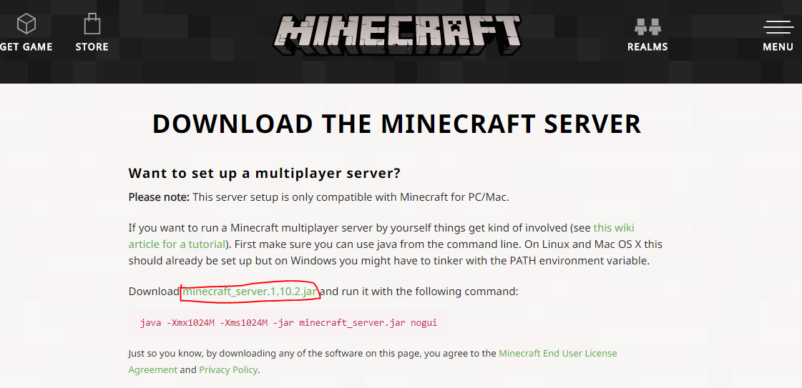
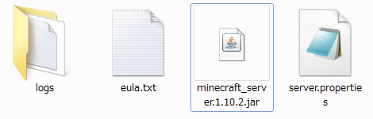
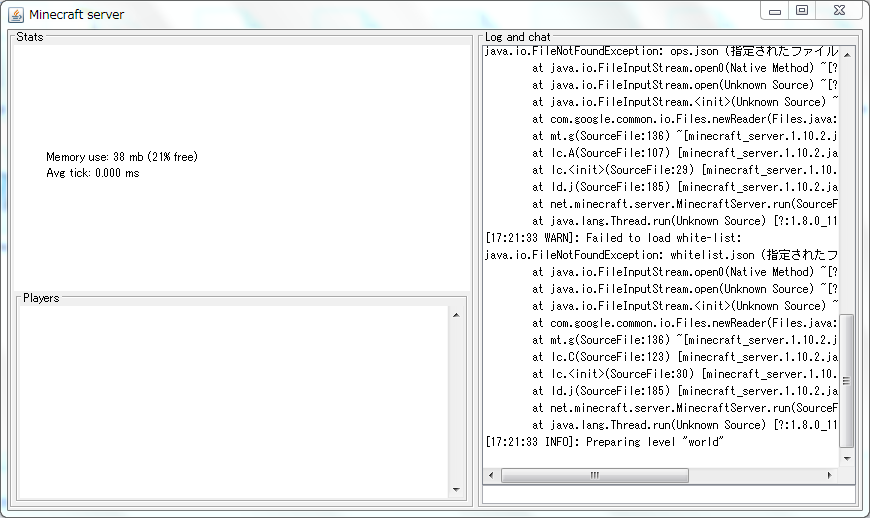
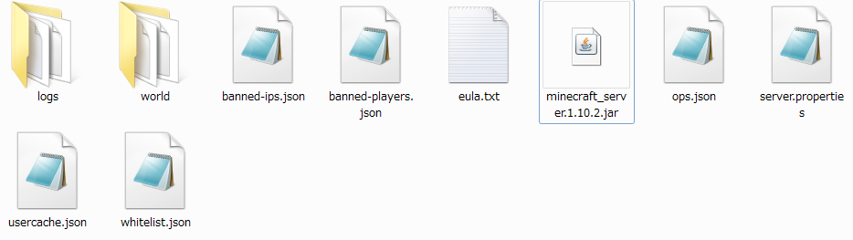
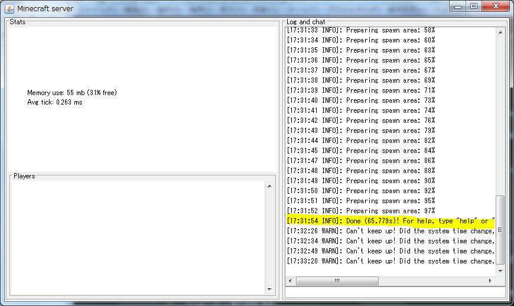

#Serverの起動方法

このページは作成現在の画像/文章です。

##multiplayer server
Minecraft公式が出しているマルチツールの場合。
まず、ダウンロードページに行きます。
ページに行ったら、「minecraft_server.1.10.2.jar(2016/10/26現在)」をクリックします。

クリックするとダウンロードが始まります。

<code>拡張子が<b>.zip</b>でダウンロードされる場合は拡張子を<b>.jar</b>に変えてください。</code>

ダウンロードしたminecraft_server.1.10.2.jarをデスクトップなどに移動します。

その際、ディレクトリを作成し、そのディレクトリに入れることをお勧めします。

 
minecraft_server.1.10.2.jarをダブルクリックして起動します。

この状態では、サーバは起動していないので接続できません。

起動すると、以下のようなディレクトリ/ファイルが生成されます。

 
eula.txtというテキストファイルを開きます。
テキストの内容は以下のなります。
By changing the setting below to TRUE you are indicating your agreement to our EULA (https://account.mojang.com/documents/minecraft_eula).
和訳: trueに設定することはEULA(https://account.mojang.com/documents/minecraft_eula)に同意したことを示す。
要するに、「MinecraftのEULAに同意するのであれば、下をtrueにしてね」ということです。
 
https://account.mojang.com/documents/minecraft_eulaをよく読んで同意するならeulaをfalseからtrueにしてください。
trueにしたら上書き保存します。
 
では、minecraft_server.1.10.2.jarを再び起動します。
起動すると、以下のようなものが出てくると思います。

これは、サーバコンソールと呼ばれるものです。基本的にコンソールと呼ばれます。
 
起動するとディレクトリにさまざまなファイルやディレクトリが生成されると思います。

これは全てサーバを起動し運営するに当たり必要なものです。説明は以下のようになります。<table class="table table-bordered">
<tr>
<th>#</th><th></th>
</tr>
<tr>
<td>logs</td> <td>サーバのログを格納するディレクトリ。最新のログはlatest.logとなる。一度サーバを停止したりすると<年-月-日-1(や2等)>.log.gzと圧縮(?)される。</td>
</tr>
<tr>
<td>world</td> <td>ワールドデータを格納するディレクトリ</td>
</tr>
<tr>
<td>banned-ips.json</td> <td>IPBANをした時に書き込まれる。</td>
</tr>
<tr>
<td>banned-players.json</td> <td>プレイヤーをBANした際に書き込まれる</td>
</tr>
<tr>
<td>ops.json</td> <td>OP権限(サーバの全権限)を与えた際に書き込まれる。※サーバを停止させたりする為、信頼できる人以外に与えないこと</td>
</tr>
<tr>
<td>server.properties</td> <td>サーバの設定ファイル。OP権限の制限(stop,reloadコマンドの制限など)やコマンドブロックの使用の有無やポートの設定などが行える。</td>
</tr>
<tr>
<td>usercache.json</td> <td>プレイヤーデータが保存されている(らしい)</td>
</tr>
<tr>
<td>whitelist.json</td> <td>ホワイトリスト関係のデータが保存される。</td>
</tr>
</table>

現在は、json形式のため、編集には技術が必要かもしれません

 
サーバが正常に起動されたかを確認するにはコンソールのログ欄に「For help, type "help" or "?"」があれば正常にサーバは起動しています。

## batファイルを作成する場合
一部環境では、サーバコンソールが出ない場合があるようです。

その際の対処方としてbatファイルを作成することで何とかなるようです。

作成する手順は次のようになります。

サーバのデータのあるディレクトリ内で「右クリック>新規作成>テキスト ドキュメント」を作成します。
(ファイル名は何でもかまいません。分かりやすいものがいいと思います)

作成したテキストドキュメントを編集します。内容はいかのようにします

<code>@echo off
java -Xms1024M -Xmx1024M -jar <サーバーのjar> nogui
pause</code>

これにして上書き保存します。

このままでは使えないので拡張子を変更します。
.txtから.batにします。
このときに「拡張子を変更するとファイルが使えなくなる場合があります」とダイアログが出ると思いますが、気にせず「はい」をクリックします。

これで、batファイルになったのでダブルクリックすると起動させることが出来ます。

## 謝辞
このページ作成において以下のサイトを参考にさせて頂きました。
・Minecraft Japan Wiki
    ・http://www26.atwiki.jp/minecraft/pages/1433.html
